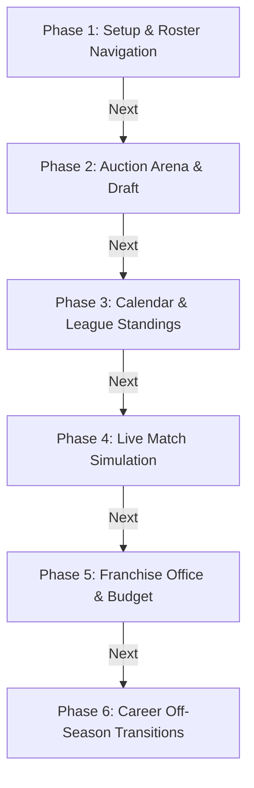

# Mobile Porting Plan: Route-by-Route Phased Roadmap

This directory contains the detailed specifications and checklists to port the **Fantasy Cricket Grand Manager** Svelte web application to a native **React Native Expo Go** mobile application. 

The plan is divided into 6 distinct modules, mapped route-by-route to mirror all functionalities of the original Svelte codebase.

---

## 📅 Roadmap Overview & Execution Order

Please instruct the agent to implement these phases one by one in the order listed below.

### 🗂️ Detailed Phase Roadmap

| Phase | Module / Route | Source Svelte Route | Plan Specification File |
| :--- | :--- | :--- | :--- |
| **Phase 1** | Main Menu & Squad Roster | `src/routes/+page.svelte` `src/routes/squad/+page.svelte` `src/routes/guide/+page.svelte` | [phase_1_setup_roster.md](file:///home/user1/game/fantasy_cricmanager/mobile_version/plan/phase_1_setup_roster.md) |
| **Phase 2** | Live Auction Room | `src/routes/auction/+page.svelte` | [phase_2_auction_draft.md](file:///home/user1/game/fantasy_cricmanager/mobile_version/plan/phase_2_auction_draft.md) |
| **Phase 3** | Calendar & League Hub | `src/routes/tournament/+page.svelte` `src/routes/teams/+page.svelte` `src/routes/training/+page.svelte` | [phase_3_dashboard_league.md](file:///home/user1/game/fantasy_cricmanager/mobile_version/plan/phase_3_dashboard_league.md) |
| **Phase 4** | Match Simulation Engine | `src/routes/match/+page.svelte` | [phase_4_match_engine.md](file:///home/user1/game/fantasy_cricmanager/mobile_version/plan/phase_4_match_engine.md) |
| **Phase 5** | Office & Finance Hub | `src/routes/budget/+page.svelte` `src/routes/club/+page.svelte` | [phase_5_franchise_ops.md](file:///home/user1/game/fantasy_cricmanager/mobile_version/plan/phase_5_franchise_ops.md) |
| **Phase 6** | Off-Season Career Transitions | `src/routes/season-review/+page.svelte` `src/routes/retention/+page.svelte` `src/routes/scouting/+page.svelte` | [phase_6_offseason_transition.md](file:///home/user1/game/fantasy_cricmanager/mobile_version/plan/phase_6_offseason_transition.md) |

---

## 🛠️ Porting Guidelines
1. **No Ad-Hoc Styling**: Strictly use the mobile design system tokens mapped in `mobile_version/src/utils/theme.ts`.
2. **Pure Logic Retention**: Keep game logic (simulation algorithms, AI bid weights, career progress coefficients) 100% equivalent to the original Svelte core engines.
3. **No Placeholders**: Ensure all screens are fully functional, interactive, and optimized for Android and iOS touch screens.
